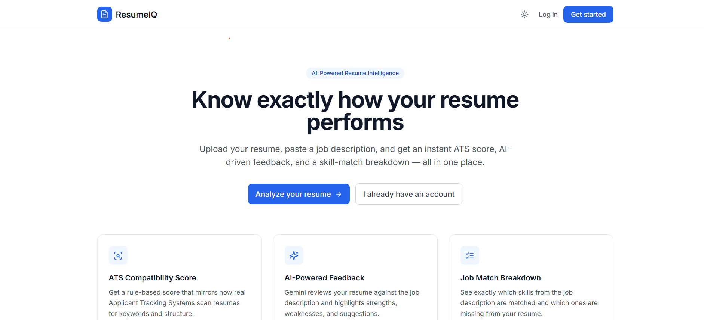
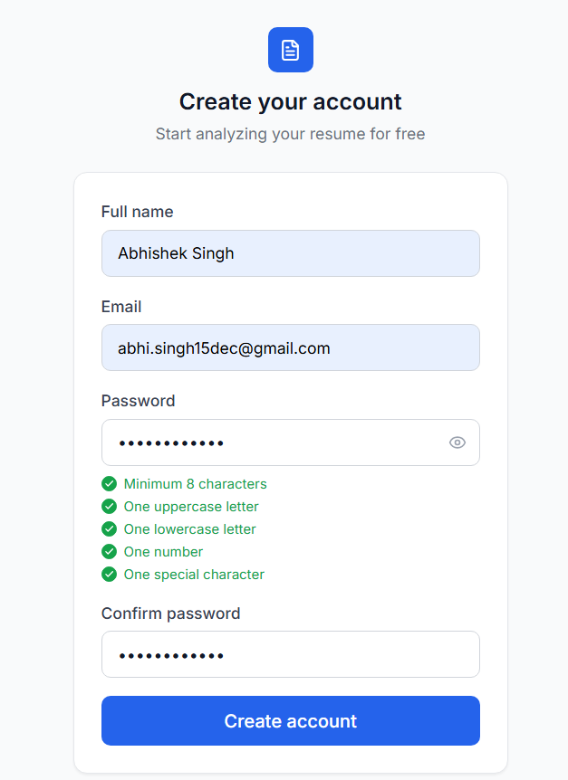
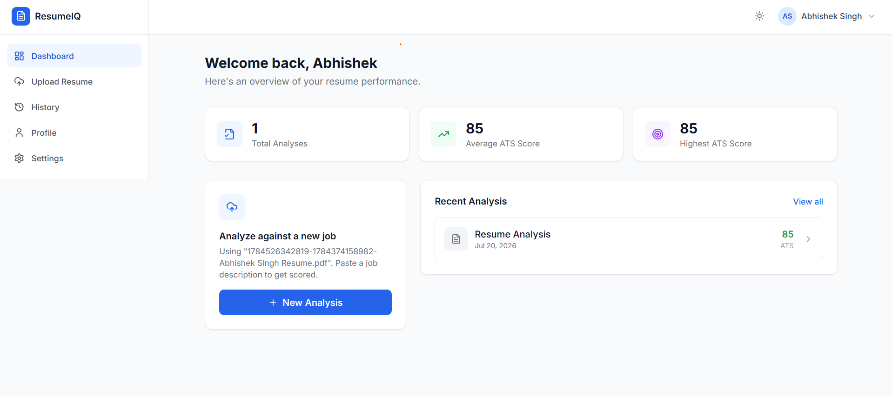
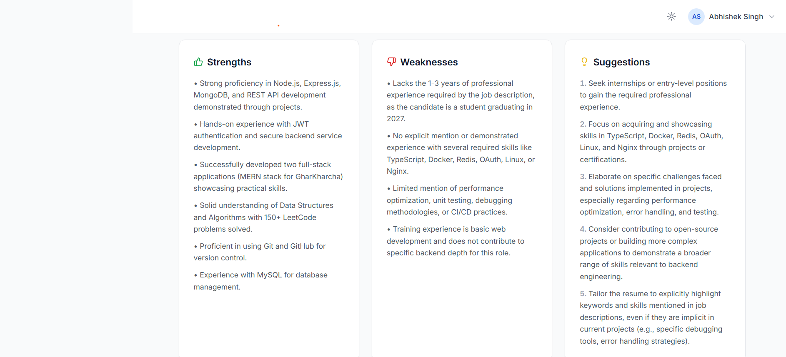
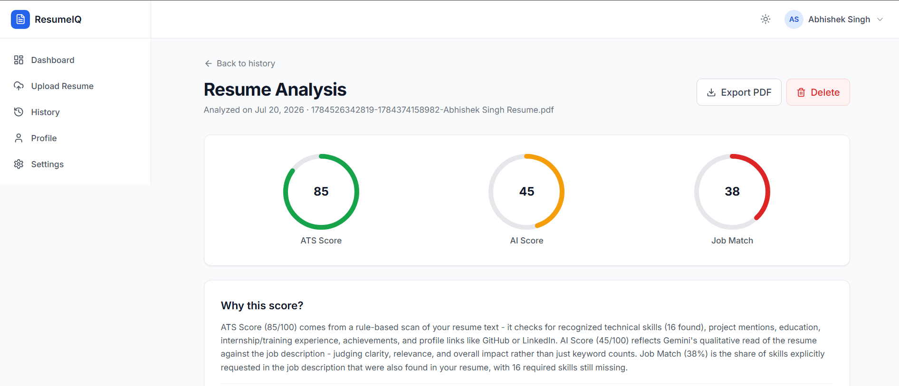

# 🚀 ResumeIQ - AI Resume Analyzer

ResumeIQ is an AI-powered resume analysis platform designed to help candidates improve their resumes and increase their chances of getting shortlisted.

The platform analyzes resumes, calculates ATS compatibility scores, matches resumes with job descriptions, identifies missing skills, and provides AI-powered improvement suggestions using Google Gemini AI.

---

## 🌐 Live Demo

🔗 **ResumeIQ Website:**  
https://resume-iq-sigma-nine.vercel.app/

---

# ✨ Key Features

## 📄 AI Resume Analysis

- Upload resumes in PDF format
- Extract resume content automatically
- Analyze resume quality using AI
- Generate actionable improvement suggestions

---

## 🤖 AI-Powered Insights

- Google Gemini AI based resume evaluation
- Resume strengths and weaknesses analysis
- Personalized recommendations
- Skill improvement suggestions

---

## 📊 ATS Score & Job Matching

- ATS compatibility scoring
- Job description based resume analysis
- Matched skills detection
- Missing skills identification
- Resume optimization suggestions

---

## 🔐 Authentication & User Management

- Secure user registration and login
- JWT-based authentication
- Protected routes
- User profile management

---

## 📚 Resume History

- Store previous resume analyses
- View past results
- Manage uploaded resumes
- Track improvement over time

---

## 🎨 User Experience

- Modern responsive interface
- Dark and light theme support
- Clean dashboard experience
- Mobile-friendly design

---

# 🛠️ Tech Stack

## Frontend

- React.js
- Vite
- Tailwind CSS
- Axios
- React Router
- Context API

---

## Backend

- Node.js
- Express.js
- REST APIs
- JWT Authentication
- Multer for file handling

---

## Database

- MongoDB Atlas
- Mongoose ODM

---

## AI Integration

- Google Gemini API

---

## Deployment

- Frontend: Vercel
- Backend: Render
- Database: MongoDB Atlas

---

# 🏗️ Application Architecture

```
                 User
                   |
                   |
            React Frontend
               (Vercel)
                   |
                   |
          Node.js + Express API
              (Render)
                   |
                   |
            MongoDB Atlas
                   |
                   |
            Gemini AI Service
```

---

# 📂 Project Structure

```
ResumeIQ
│
├── client
│   ├── components
│   ├── pages
│   ├── services
│   └── context
│
├── server
│   ├── controllers
│   ├── routes
│   ├── models
│   ├── middleware
│   └── services
│
└── README.md
```

---

# 🔒 Security Practices

- Sensitive credentials are stored using environment variables
- API keys are not exposed on the frontend
- JWT authentication is used for protected routes
- Database credentials are secured
- Secret configuration files are excluded from version control

---

# 📸 Screenshots

## 🏠 Landing Page


## 🔐 Authentication Pages


## 📊 User Dashboard


## 📄 Resume Upload Interface


## 🤖 AI Analysis Results


## 📈 ATS Score Visualization


---

# 🚀 Future Enhancements

- Resume template generator
- Multiple resume comparison
- AI interview preparation
- Career roadmap suggestions
- Advanced ATS optimization

---

# 👨‍💻 Author

**Abhishek Singh**

GitHub:  
https://github.com/abhishek1531

---

# 📄 License

This project is developed for portfolio, learning, and demonstration purposes.